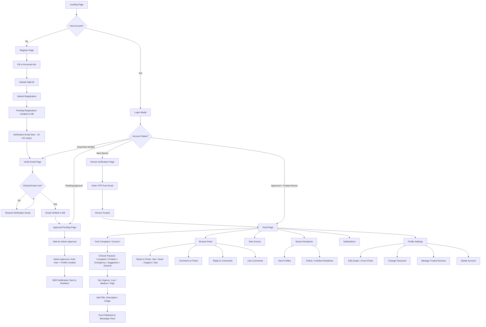
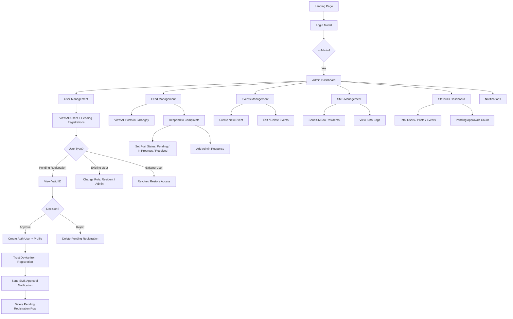
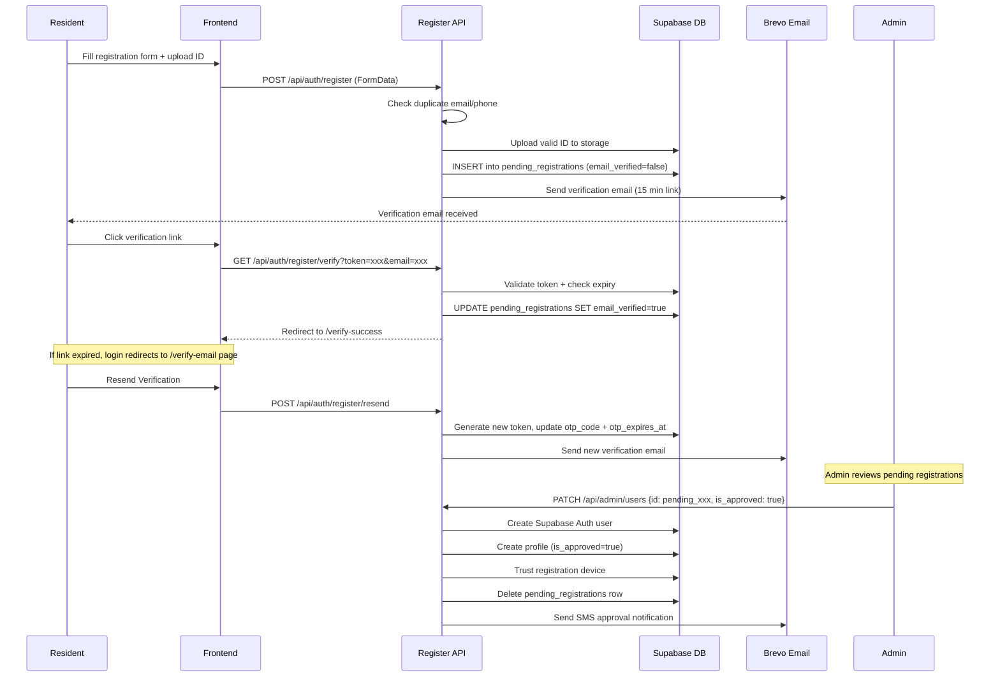
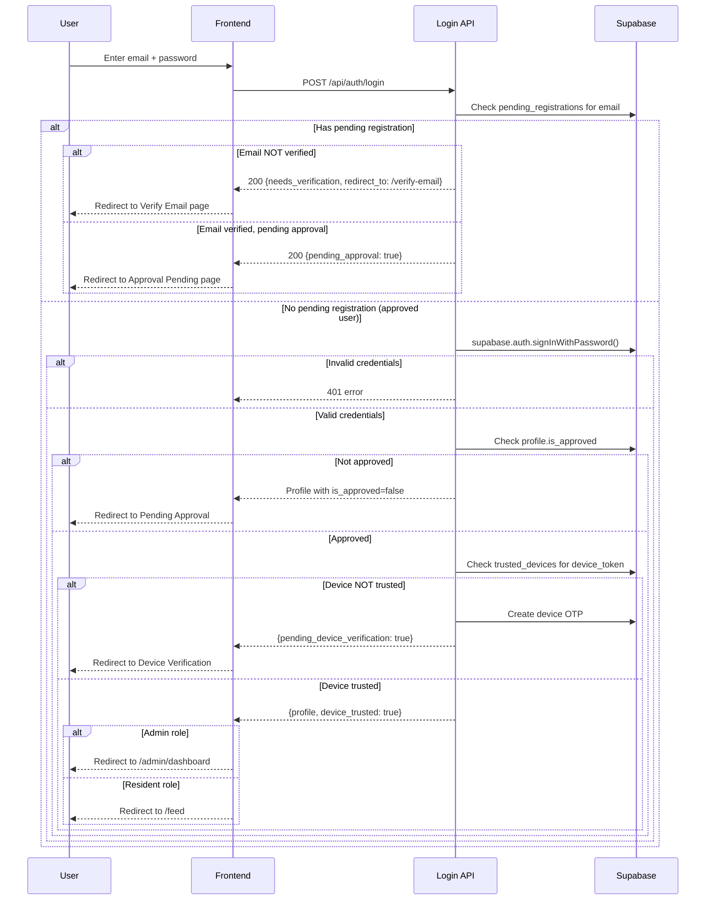
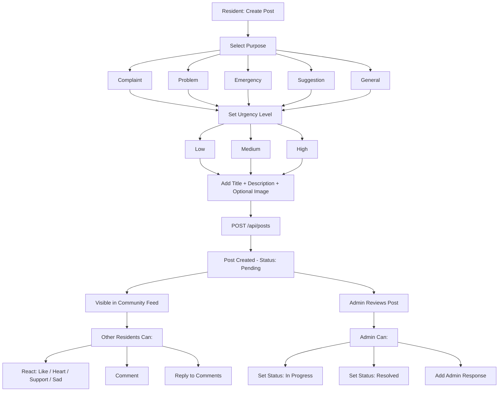

# BarangayPGT — System Flowcharts

## Resident Flow

---

## Admin Flow

---

## Registration and Verification Flow (Detailed)

---

## Login and Authentication Flow (Detailed)

---

## Post and Complaint Flow

